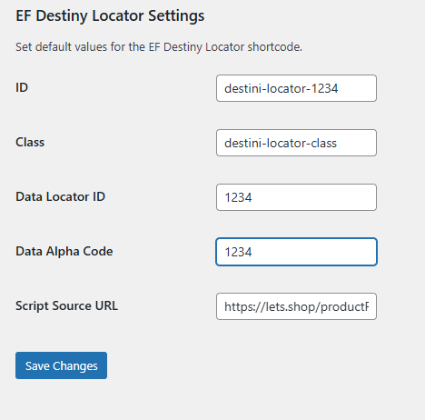
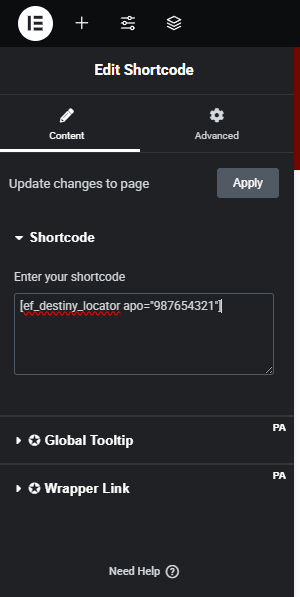

# EF Destiny Locator


A simple WordPress plugin that allows you to setup Destiny settings and using a shortcode where you provide the APO code to launch a store locator for a item in any page.

## Installation

1. In Plugins section,  go to Add New Plugin, then to Upload Plugin
2. Upload the plugin.
3. Activate the plugin.



## Setup

It's important to have already setup the settings for the Store Locator.  To do this, just go to Settings menu and select "EF Destiny Locator Settings", and fill up all the fields.

## Usage

Create or Edit a Page or Post and select a location to add a shortcode with the correct APO value in this manner:

```ini
[ef-destiny-locator apo="1234567890"]
```



Save and plublish your page/post.
